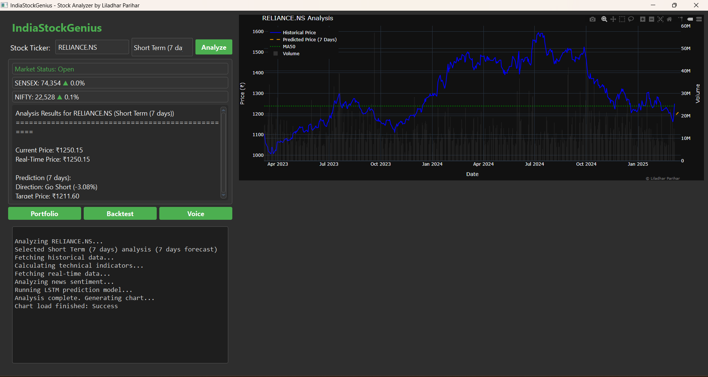

# IndiaStockGenius

A powerful stock analysis and prediction application specifically designed for Indian stock market (NSE) with real-time data, LSTM-based predictions, and technical analysis.

 *(You can add a screenshot of your application here)*

## Features

- **Real-time Market Data**
  - Live SENSEX and NIFTY indices tracking
  - Real-time stock price updates
  - Market status indicator (Open/Closed)

- **Advanced Stock Analysis**
  - LSTM-based price predictions
  - Multiple prediction timeframes (7, 30, 90 days)
  - Technical indicators (RSI, MACD, MA50, Bollinger Bands)
  - Volume analysis overlay
  - Interactive charts with zoom capabilities

- **Risk Analysis**
  - Volatility assessment
  - Stop-loss recommendations
  - Market sentiment analysis
  - Model confidence metrics

- **User-Friendly Interface**
  - Dark theme for better visibility
  - Auto-complete stock ticker search
  - Real-time console logging
  - Responsive chart display

## Installation

1. Clone the repository:
```bash
git clone https://github.com/yourusername/IndiaStockGenius.git
cd IndiaStockGenius
```

2. Install dependencies:
```bash
python check_dependencies.py --install
```

3. Run the application:
```bash
python main.py
```

## Requirements

- Python 3.8+
- PyQt5
- yfinance
- pandas
- numpy
- plotly
- tensorflow (for LSTM model)
- Other dependencies are handled by check_dependencies.py

## Usage

1. Launch the application
2. Enter a stock ticker (e.g., RELIANCE.NS, TCS.NS)
3. Select prediction timeframe (Short/Medium/Long Term)
4. Click "Analyze" to get comprehensive analysis
5. View results in the analysis panel and interactive chart

## Features in Detail

### Technical Analysis
- RSI (Relative Strength Index)
- Moving Averages (50-day)
- MACD (Moving Average Convergence Divergence)
- Bollinger Bands
- Volume Analysis

### Prediction System
- LSTM (Long Short-Term Memory) neural network
- Historical data training
- Multiple timeframe predictions
- Confidence metrics

### Market Data
- Real-time price updates
- SENSEX and NIFTY tracking
- Market sentiment analysis
- News integration

## Contributing

Contributions are welcome! Please feel free to submit a Pull Request.

1. Fork the repository
2. Create your feature branch (`git checkout -b feature/AmazingFeature`)
3. Commit your changes (`git commit -m 'Add some AmazingFeature'`)
4. Push to the branch (`git push origin feature/AmazingFeature`)
5. Open a Pull Request

## License

This project is licensed under the MIT License - see the [LICENSE](LICENSE) file for details.

## Author

**Liladhar Parihar**

## Acknowledgments

- yfinance for providing market data
- PyQt5 for the GUI framework
- Plotly for interactive charts
- TensorFlow for LSTM implementation

## Disclaimer

This software is for educational and research purposes only. Do not use it for financial decisions without proper verification. The predictions and analysis provided by this tool should not be considered as financial advice. 